# Web Playground

InstaHarvest v2 Web Playground — a full-featured browser-based interface for testing and interacting with the entire InstaHarvest v2 library. Includes AI Chat, real-time API testing, data saving, and CSV export.

## Quick Start

```bash
pip install fastapi uvicorn
python demo_server.py
# Opens http://localhost:8877
```

### CLI Options

```bash
python demo_server.py [OPTIONS]
```

| Option | Default | Description |
| --- | --- | --- |
| `--port` | `8877` | Server port |
| `--host` | `127.0.0.1` | Server host |
| `--env` | `.env` | Path to .env file |

### Requirements

- `fastapi` — web framework
- `uvicorn` — ASGI server
- `.env` file with Instagram credentials
- `GEMINI_API_KEY` or `OPENAI_API_KEY` (optional, for AI Chat)

---

## Architecture

```mermaid
graph TB
    Browser["🌐 Browser UI"] -->|HTTP| Server["⚡ FastAPI Server"]
    
    Server -->|/api/ai/*| Agent["🤖 InstaAgent"]
    Server -->|/api/users/*| Users["👤 UsersAPI"]
    Server -->|/api/media/*| Media["📷 MediaAPI"]
    Server -->|/api/feed/*| Feed["📰 FeedAPI"]
    Server -->|/api/search/*| Search["🔍 SearchAPI"]
    Server -->|/api/stories/*| Stories["📱 StoriesAPI"]
    Server -->|/api/friendships/*| Friends["🤝 FriendshipsAPI"]
    Server -->|/api/account/*| Account["⚙️ AccountAPI"]
    Server -->|/api/public/*| Public["🌍 PublicAPI"]
    Server -->|/api/save| Storage["💾 JSON Storage"]
    Server -->|/api/export/csv| Export["📊 CSV Export"]
    
    subgraph Instagram Client
        Users
        Media
        Feed
        Search
        Stories
        Friends
        Account
        Public
    end
```



### UI Panels

| Panel | Description |
| --- | --- |
| **AI Chat** | Natural language interface powered by InstaAgent |
| **Users** | Profile lookup, search, bio parsing |
| **Media** | Post info, likers, comments |
| **Feed** | User feed, hashtag feed, liked, saved |
| **Search** | Top search, users, hashtags, places, explore |
| **Stories** | User stories, highlights, tray |
| **Friendships** | Followers, following, mutual, pending |
| **Account** | Current user, blocked, restricted, privacy |
| **Public** | Anonymous profile/posts (no login required) |
| **Hashtags** | Hashtag info |
| **Notifications** | Raw, parsed, counts, follow, like |
| **Direct** | Inbox |
| **Saved** | View/manage saved results |
| **History** | Request history log |
| **Dashboard** | System statistics |

---

## API Reference

All endpoints return a unified JSON response:

```json
{
    "success": true,
    "message": "OK",
    "data": { ... },
    "timestamp": 1740567890.5
}
```

On error:

```json
{
    "success": false,
    "error": "Error description",
    "timestamp": 1740567890.5
}
```

### System

| Method | Endpoint | Description |
| --- | --- | --- |
| `GET` | `/api/status` | Server status, uptime, request counts, AI availability |
| `GET` | `/api/history` | Request history (last 50) |
| `GET` | `/api/dashboard` | Instagram client dashboard stats |

### AI Chat

| Method | Endpoint | Description |
| --- | --- | --- |
| `POST` | `/api/ai/ask` | Send a natural language question |
| `POST` | `/api/ai/reset` | Reset conversation history |
| `GET` | `/api/ai/history` | Get AI conversation history |

**POST `/api/ai/ask`** body:

```json
{
    "message": "Get Cristiano's follower count"
}
```

Response:

```json
{
    "success": true,
    "answer": "Cristiano has 650M followers",
    "code": "user = ig.users.get_by_username('cristiano')...",
    "files": [],
    "steps": 2,
    "tokens": 1200,
    "duration": 3.5,
    "error": null
}
```

### Data & Export

| Method | Endpoint | Description |
| --- | --- | --- |
| `POST` | `/api/save` | Save result to JSON file |
| `GET` | `/api/saved` | List all saved files |
| `GET` | `/api/saved/{filename}` | Get saved file content |
| `DELETE` | `/api/saved/{filename}` | Delete saved file |
| `POST` | `/api/export/csv` | Export data as CSV download |

### Users

| Method | Endpoint | Description |
| --- | --- | --- |
| `GET` | `/api/users/username/{username}` | Get user by username |
| `GET` | `/api/users/id/{user_id}` | Get user by ID |
| `GET` | `/api/users/search?q=query` | Search users |
| `GET` | `/api/users/full/{username}` | Full profile (posts + followers) |
| `GET` | `/api/users/bio/{username}` | Parse bio (emails, phones, links) |

### Media

| Method | Endpoint | Description |
| --- | --- | --- |
| `GET` | `/api/media/info/{media_pk}` | Get media info |
| `GET` | `/api/media/full/{media_pk}` | Full media details |
| `GET` | `/api/media/v2/{media_pk}` | Media info (v2 endpoint) |
| `GET` | `/api/media/by-url?url=...` | Get media by Instagram URL |
| `GET` | `/api/media/likers/{media_pk}` | Get likers of a post |
| `GET` | `/api/media/comments/{media_pk}` | Get parsed comments |

### Feed

| Method | Endpoint | Description |
| --- | --- | --- |
| `GET` | `/api/feed/user/{user_pk}?count=12` | User's feed |
| `GET` | `/api/feed/tag/{hashtag}` | Hashtag feed |
| `GET` | `/api/feed/liked` | Your liked posts |
| `GET` | `/api/feed/saved` | Your saved posts |

### Search

| Method | Endpoint | Description |
| --- | --- | --- |
| `GET` | `/api/search/top?q=query` | Top search (mixed results) |
| `GET` | `/api/search/users?q=query` | Search users only |
| `GET` | `/api/search/hashtags?q=query` | Search hashtags |
| `GET` | `/api/search/places?q=query` | Search places |
| `GET` | `/api/search/explore` | Explore page content |

### Stories

| Method | Endpoint | Description |
| --- | --- | --- |
| `GET` | `/api/stories/user/{user_pk}` | User's active stories |
| `GET` | `/api/stories/highlights/{user_pk}` | User's highlights tray |
| `GET` | `/api/stories/tray` | Your stories tray |

### Friendships

| Method | Endpoint | Description |
| --- | --- | --- |
| `GET` | `/api/friendships/followers/{user_pk}?count=50` | Get followers |
| `GET` | `/api/friendships/following/{user_pk}?count=50` | Get following |
| `GET` | `/api/friendships/status/{user_pk}` | Friendship status |
| `GET` | `/api/friendships/mutual/{user_pk}` | Mutual followers |
| `GET` | `/api/friendships/pending` | Pending follow requests |

### Account

| Method | Endpoint | Description |
| --- | --- | --- |
| `GET` | `/api/account/me` | Current user profile |
| `GET` | `/api/account/blocked` | Blocked users list |
| `GET` | `/api/account/restricted` | Restricted users list |
| `GET` | `/api/account/login-activity` | Login activity |
| `GET` | `/api/account/privacy` | Privacy settings |
| `GET` | `/api/account/info` | Account info |

### Public (No Login)

| Method | Endpoint | Description |
| --- | --- | --- |
| `GET` | `/api/public/profile/{username}` | Public profile |
| `GET` | `/api/public/posts/{username}?count=12` | Public posts |

### Hashtags

| Method | Endpoint | Description |
| --- | --- | --- |
| `GET` | `/api/hashtags/info/{tag}` | Hashtag information |

### Notifications

| Method | Endpoint | Description |
| --- | --- | --- |
| `GET` | `/api/notifications` | Raw notifications |
| `GET` | `/api/notifications/counts` | Notification counts |
| `GET` | `/api/notifications/parsed` | Parsed notifications |
| `GET` | `/api/notifications/follows` | Follow notifications |
| `GET` | `/api/notifications/likes` | Like notifications |

### Direct Messages

| Method | Endpoint | Description |
| --- | --- | --- |
| `GET` | `/api/direct/inbox` | DM inbox |

---

## Data Saving

Results from any API call can be saved to disk:

```bash
# Save current result
curl -X POST http://localhost:8877/api/save \
  -H "Content-Type: application/json" \
  -d '{"name": "cristiano_profile"}'

# List saved files
curl http://localhost:8877/api/saved

# Download as CSV
curl -X POST http://localhost:8877/api/export/csv \
  -H "Content-Type: application/json" \
  -d '{"data": {"data": [{"username": "cr7", "followers": 650000000}]}}'
```

Saved files are stored in `demo/saved/` directory as JSON.

---

## Programmatic Usage

```python
from demo_server import app

# Use directly with uvicorn
import uvicorn
uvicorn.run(app, host="0.0.0.0", port=8877)
```

Or import and customize the FastAPI app:

```python
from demo_server import app, get_ig

# Add your own endpoints
@app.get("/api/custom/my-endpoint")
async def my_endpoint():
    ig = get_ig()
    # Your custom logic
    return {"result": "..."}
```
