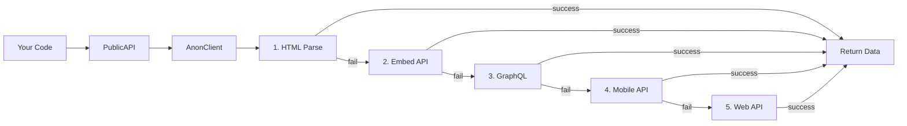

# Anonymous Scraping — Overview

InstaAPI's anonymous scraping system can access public Instagram data **without login** using a 5-strategy fallback chain.

## How It Works



If one strategy fails (rate limited, blocked, etc.), it automatically tries the next one.

## The 5 Strategies

| # | Strategy | Endpoint | Speed | Data |
|---|---|---|---|---|
| 1 | HTML Parse | `instagram.com/{user}/` | Fast | Profile + meta |
| 2 | Embed API | `instagram.com/p/{code}/embed/` | Fast | Post data |
| 3 | GraphQL | `graphql/query/` | Medium | Full profile + posts |
| 4 | Mobile API | `i.instagram.com/api/v1/` | Medium | Rich feed data |
| 5 | Web API | `i.instagram.com/api/v1/` | Medium | Profile info |

## Available Data (No Login)

| Data Type | Method | Works? |
|---|---|---|
| Profile info | `get_profile()` | ✅ |
| Posts (12) | `get_posts()` | ✅ |
| Post by URL | `get_post_by_url()` | ✅ |
| Post comments | `get_comments()` | ✅ |
| Media URLs | `get_media_urls()` | ✅ |
| Search | `search()` | ✅ |
| Reels | `get_reels()` | ✅ |
| Mobile feed | `get_feed()` | ✅ |
| All posts (paginated) | `get_all_posts()` | ✅ |
| Hashtag posts | `get_hashtag_posts()` | ✅ |
| Location posts | `get_location_posts()` | ✅ |
| Similar accounts | `get_similar_accounts()` | ✅ |
| Highlights | `get_highlights()` | ✅ |
| Stories | ❌ | Login required |
| Followers/Following | ❌ | Login required |
| DM | ❌ | Login required |

## Quick Example

```python
from instaharvest_v2 import Instagram

ig = Instagram.anonymous()

# Profile
profile = ig.public.get_profile("cristiano")
print(f"@{profile['username']}: {profile['followers']:,} followers")

# Posts
posts = ig.public.get_posts("cristiano")
for post in posts[:3]:
    print(f"  ❤️ {post['likes']:,}  💬 {post['comments']}")

# Search
results = ig.public.search("fashion")
for user in results["users"][:3]:
    print(f"  @{user['username']}")
```

## Two API Levels

| Level | Class | For |
|---|---|---|
| **High-level** | `PublicAPI` / `AsyncPublicAPI` | Easy, clean interface |
| **Low-level** | `AnonClient` / `AsyncAnonClient` | Direct endpoint access |

```python
# High-level (recommended)
profile = ig.public.get_profile("nike")

# Low-level (more control)
raw = ig._anon_client.get_web_profile("nike")
```
