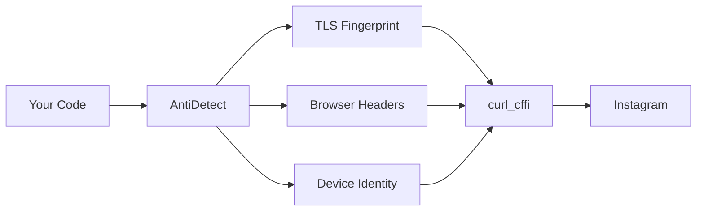

# Anti-Detection System

InstaHarvest v2 uses `curl_cffi` to impersonate real browsers at the TLS level — making requests indistinguishable from genuine browser traffic.

## How It Works



## TLS Fingerprint Rotation

Every request uses a **different browser identity**:

```python
# Automatic — no config needed
ig = Instagram.anonymous()
profile = ig.public.get_profile("nike")
# Request 1: Chrome 142 on macOS
# Request 2: Safari 17 on iPhone
# Request 3: Edge 131 on Windows
```

### Supported Browsers

| Browser | Versions |
|---|---|
| Chrome | 99, 100, 101, ..., 142 |
| Safari | 15.3, 15.5, 16.0, 17.0 |
| Edge | 99, 101, 131 |
| Firefox | 102, 110 |

## Header Randomization

Each request gets unique, browser-accurate headers:

| Header | Behavior |
|---|---|
| `User-Agent` | Matches TLS fingerprint browser |
| `Accept-Language` | Random from common locales |
| `Sec-Ch-Ua` | Matches browser version |
| `Sec-Fetch-*` | Correct for request type |
| `X-IG-App-ID` | Instagram web app ID |
| `X-IG-WWW-Claim` | Session claim token |

## Per-Request Identity

```python
# Each request = new identity
# Request 1:
#   TLS: Chrome 142
#   UA: Mozilla/5.0 (Macintosh; Intel Mac OS X 10_15_7) Chrome/142.0
#   Proxy: proxy1.com

# Request 2:
#   TLS: Safari 17
#   UA: Mozilla/5.0 (iPhone; CPU iPhone OS 17_0) Safari/605.1
#   Proxy: proxy2.com
```

## Device Fingerprint

For mobile API requests, InstaHarvest v2 generates realistic device fingerprints:

```python
from instaharvest_v2.device_fingerprint import DeviceFingerprint

df = DeviceFingerprint()
device = df.generate()
# {
#     "device_model": "SM-G998B",
#     "android_version": "13",
#     "android_release": "33",
#     "manufacturer": "Samsung",
#     "device_dpi": "640dpi",
#     "resolution": "1440x3200",
#     "app_version": "302.1.0.36.111",
#     "version_code": "559928404",
# }
```

## 401/403 Auto-Retry

When Instagram returns 401 or 403:

1. **Rotate proxy** — switch to next working proxy
2. **New TLS fingerprint** — different browser identity
3. **New headers** — fresh User-Agent, Accept-Language
4. **Retry request** — with completely new identity

```python
# Automatic — no config needed
ig = Instagram.anonymous()
# If request fails with 401/403:
#   → Auto rotate proxy
#   → Auto change browser fingerprint
#   → Auto retry (up to 3 times)
```
