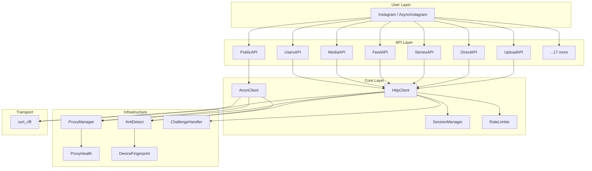

# Architecture

InstaHarvest v2 is built with a modular, layered architecture.

## System Overview



## Module Map

| Module | File | Purpose |
|---|---|---|
| **Instagram** | `instagram.py` | Main sync class — unifies all APIs |
| **AsyncInstagram** | `async_instagram.py` | Main async class — true async I/O |
| **AnonClient** | `anon_client.py` | Anonymous scraping — 5 strategy chain |
| **AsyncAnonClient** | `async_anon_client.py` | Async anonymous scraping |
| **HttpClient** | `client.py` | Authenticated HTTP client |
| **AsyncHttpClient** | `async_client.py` | Async authenticated HTTP |
| **SessionManager** | `session_manager.py` | Multi-session management |
| **ProxyManager** | `proxy_manager.py` | Proxy rotation + scoring |
| **AntiDetect** | `anti_detect.py` | TLS fingerprint + headers |
| **RateLimiter** | `rate_limiter.py` | Token bucket rate control |
| **SpeedModes** | `speed_modes.py` | SAFE/FAST/TURBO/UNLIMITED |
| **ChallengeHandler** | `challenge.py` | Email/SMS auto-verification |
| **DeviceFingerprint** | `device_fingerprint.py` | Mobile device simulation |
| **EventEmitter** | `events.py` | Event hooks system |
| **Plugin** | `plugin.py` | Plugin architecture |

## Two Operation Modes

=== "Anonymous (No Login)"

    ```
    Instagram.anonymous()
        → PublicAPI
            → AnonClient
                → 5 strategies (no cookies needed)
                    → curl_cffi (TLS fingerprint)
    ```

=== "Authenticated (Login)"

    ```
    Instagram.from_env()
        → UsersAPI, MediaAPI, FeedAPI, ...
            → HttpClient
                → SessionManager (cookies)
                    → curl_cffi (TLS fingerprint)
    ```

## Design Patterns

| Pattern | Where | Why |
|---|---|---|
| **Strategy** | AnonClient | 5 fallback strategies for resilience |
| **Chain of Responsibility** | Fallback chain | Auto-try next on failure |
| **Factory** | `Instagram.from_env()` | Clean initialization |
| **Observer** | EventEmitter | Decoupled event handling |
| **Proxy** | ProxyManager | Transparent proxy rotation |
| **Singleton** | Config | Shared configuration |
| **Builder** | StoryComposer | Fluent story creation |
