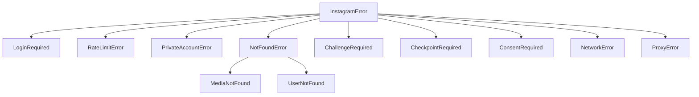

# Error Handling

InstaAPI uses a structured exception hierarchy for precise error handling.

## Exception Hierarchy



## Exception Reference

| Exception | Status | When |
|---|---|---|
| `InstagramError` | — | Base class for all errors |
| `LoginRequired` | 302/401 | Session expired or login needed |
| `RateLimitError` | 429 | Too many requests |
| `PrivateAccountError` | 403 | Cannot access private account |
| `NotFoundError` | 404 | User or resource not found |
| `UserNotFound` | 404 | Specific user not found |
| `MediaNotFound` | 404 | Specific media not found |
| `ChallengeRequired` | 400 | Captcha or phone verification |
| `CheckpointRequired` | 400 | Identity checkpoint |
| `ConsentRequired` | 400 | Terms of service consent |
| `NetworkError` | — | Connection/timeout error |
| `ProxyError` | — | Proxy connection failed |

## Usage

### Basic Try/Catch

```python
from instaharvest_v2 import Instagram
from instaharvest_v2.exceptions import (
    NotFoundError,
    PrivateAccountError,
    RateLimitError,
    LoginRequired,
)

ig = Instagram.from_env()

try:
    user = ig.users.get_by_username("cristiano")
except NotFoundError:
    print("User not found")
except PrivateAccountError:
    print("Account is private")
except RateLimitError:
    print("Rate limited — wait and retry")
except LoginRequired:
    print("Session expired — re-login needed")
```

### ChallengeRequired Details

```python
from instaharvest_v2.exceptions import ChallengeRequired

try:
    ig.login("user", "pass")
except ChallengeRequired as e:
    print(f"Challenge URL: {e.challenge_url}")
    print(f"Challenge type: {e.challenge_type}")
    print(f"Status code: {e.status_code}")
    print(f"Response: {e.response}")
```

### Error Properties

All exceptions have:

| Property | Type | Description |
|---|---|---|
| `message` | `str` | Human-readable error message |
| `status_code` | `int` | HTTP status code (0 if N/A) |
| `response` | `dict` | Raw API response body |

## Auto-Retry

InstaAPI automatically retries on transient errors:

```python
from instaharvest_v2 import Instagram
from instaharvest_v2.retry import RetryConfig

ig = Instagram(
    retry=RetryConfig(
        max_retries=3,           # Retry up to 3 times
        backoff_factor=2.0,      # Exponential backoff
        retry_on_status=[429, 500, 502, 503],
    )
)
ig.load_session("session.json")
# 429 → wait 2s → retry → wait 4s → retry → wait 8s → fail
```

## Anonymous Error Handling

Anonymous methods return `None` instead of raising:

```python
ig = Instagram.anonymous()

profile = ig.public.get_profile("nonexistent_user_12345")
if profile is None:
    print("Not found or error occurred")
```
